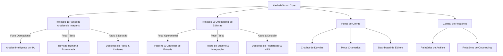

# 🔬 AletheiaVision Core — Plataforma de Integridade Científica

> **Entrega Integrada (A4)** — Protótipos 1 e 2 desenvolvidos para a disciplina de **Sistemas de Informação Gerenciais (SIG)** do curso de Sistemas de Informação.

---

## 📋 Sobre o Projeto

A **AletheiaVision IA** é uma startup de tecnologia focada na garantia da integridade de publicações científicas. A plataforma **AletheiaVision Core** unifica múltiplos fluxos operacionais em um único ecossistema web moderno, responsivo e com identidade visual premium.



---

## 🧩 Módulos do Sistema

### 1. 🔍 Protótipo 1: Painel de Análise de Imagens Científicas
O núcleo principal da proposta de valor da startup. Representa a tela de processamento científico onde artigos biomédicos submetidos são avaliados contra fraudes visuais (duplicações, manipulação de pixels, montagens de experimentos).
* **Processo:** Recebimento de submissões ➔ Análise automática da IA com geração de score de similaridade ➔ Exibição de Heatmap (Mapa de Calor) ➔ Revisão e parecer técnico do Analista Humano.

### 2. 🤝 Protótipo 2: Módulo de Onboarding de Editoras
O módulo de apoio gerencial indispensável para a viabilidade do negócio. Ele gerencia o ciclo de vida inicial das editoras científicas clientes desde o fechamento do contrato até a entrada em produção.
* **Processo:** Cadastro de editoras ➔ Acompanhamento do funil de onboarding (Pipeline) ➔ Checklist de etapas técnicas/treinamento ➔ Integrações de APIs de submissão (OJS, ScholarOne) ➔ Monitoramento de satisfação inicial (NPS) e tickets de suporte.

### 3. 🏢 Portal do Cliente (Editora)
Interface dedicada às editoras parceiras com dashboard personalizado, histórico de submissões, KPIs do cliente e gerenciamento de chamados de suporte.

### 4. 💬 Chatbot de Dúvidas (Assistente Virtual)
Chatbot flutuante disponível exclusivamente no perfil "Cliente" com respostas automáticas sobre 9 temas: submissão, prazos, score de risco, chamados, relatórios, integração API, tokens JWT, planos e contato. Inclui sugestões de perguntas rápidas sempre visíveis.

### 5. 🎫 Sistema de Tickets de Suporte
Sistema bidirecional de chamados conectando editoras clientes à equipe técnica, com visualização dupla (perspectiva do Staff e do Cliente).

### 6. 📊 Central de Relatórios
Módulo analítico completo com duas abas:
* **Análise de Imagens:** KPIs com tendências, distribuição por área/risco/status, gráfico donut de riscos, volume por editora, tipo de imagem, tabela Top 5 risco.
* **Onboarding:** KPIs, funil de pipeline, distribuição por porte/área, tabela de editoras com NPS.
* **Exportação:** Botões para exportar PDF e Power BI.

---

## 🛠️ Stack Tecnológica

| Tecnologia | Versão | Papel |
| :--- | :--- | :--- |
| **[React](https://react.dev/)** | 19.2.6 | SPA reativa e componentizada |
| **[Vite](https://vite.dev/)** | 8.0.12 | Bundler e servidor de desenvolvimento com HMR |
| **[Tailwind CSS](https://tailwindcss.com/)** | 4.3.0 | Estilização moderna com design tokens nativos |
| **[Lucide React](https://lucide.dev/)** | 1.16.0 | Ícones vetoriais SVG |
| **[ESLint](https://eslint.org/)** | 10.3.0 | Linter de qualidade de código |

---

## ✨ Recursos de Cada Módulo

### 🔍 Protótipo 1: Painel de Análise de Imagens
* **Filtros Avançados:** 5 filtros simultâneos — Período, Editora, Área (Oncologia, Genética, Microbiologia, Biomédica), Risco (Baixo, Médio, Alto) e Status.
* **Painel de KPIs da Operação:**
  * *Artigos analisados:* 412 (Volume mensal).
  * *Imagens processadas:* 1.856 (Carga técnica).
  * *Precisão da IA:* 91,3% (Qualidade de detecção).
  * *Falsos positivos:* 7,8% (Ajustes de limiar).
  * *Tempo médio por artigo:* 3min42s.
  * *Casos pendentes:* 61 (Priorização de gargalos).
* **Tabela de Submissões Dinâmica:** 12 artigos de exemplo com dados variados cobrindo todas as combinações de filtros.
* **Seção de Detalhes & Heatmap:**
  * Visualização lado a lado da **Imagem Original** (microscopia/eletroforese) e do **Mapa de Calor** simulado.
  * Informações técnicas: ID, Tipo de imagem, Score de similaridade e Data de submissão.
* **Formulário de Parecer Humano:** Decisão (Confirmar/Descartar suspeita, Solicitar nova análise), Prioridade e Justificativa técnica.

### 🤝 Protótipo 2: Onboarding de Editoras
* **Aviso de Contexto Gerencial:** Alerta explicativo sobre o papel do módulo.
* **Painel de KPIs de Adoção:** 6 indicadores operacionais.
* **Pipeline Visual (Kanban):** 6 etapas do funil — Lead recebido ➔ Demo realizada ➔ Contrato assinado ➔ Integração API ➔ Treinamento ➔ Cliente ativo.
* **Tabela de Editoras:** 10 editoras de exemplo com dados variados.
* **Checklist Técnico e Comercial:** Formulário de ação gerencial com delegação de responsáveis.
* **Central de Suporte (Tickets):** Abertura automática de tickets a partir do painel de onboarding.

### 🏢 Portal do Cliente
* **Dashboard Personalizado:** Banner de boas-vindas, KPIs do cliente (6 indicadores), Histórico de submissões.
* **Meus Chamados:** Abertura e acompanhamento de tickets de suporte.
* **Chatbot Flutuante:** Assistente virtual com sugestões rápidas e respostas automáticas.

### 📊 Central de Relatórios
* **Aba Análise de Imagens:** 7 visualizações (KPIs, barras por área, donut de risco, status, volume por editora, tipo de imagem, top 5 risco).
* **Aba Onboarding:** 5 visualizações (KPIs, funil pipeline, porte, área, tabela detalhada).
* **Exportação:** PDF e Power BI.

---

## 👥 Perfis de Acesso

| Perfil | Telas Disponíveis | Usuário Simulado |
| :--- | :--- | :--- |
| **Interno (Staff)** | Dashboard, Análise de Imagens, Revisão Humana, Onboarding, Editoras Clientes, Tickets, Relatórios, Configurações | Isaque Severino (Analista) |
| **Cliente (Editora)** | Painel da Editora, Análise de Imagem (IA), Meus Chamados, Configurações + Chatbot | Dr. Anthony Quaresma (Editor Científico) |

---

## 📊 Apoio à Decisão Gerencial (SIG)

O principal objetivo acadêmico deste ecossistema é ilustrar como a informação estruturada apoia os diferentes níveis hierárquicos na tomada de decisões em um negócio de base tecnológica:

| Nível Hierárquico | Decisões Apoiadas (Módulo 1 - Análise de Imagem) | Decisões Apoiadas (Módulo 2 - Onboarding) |
| :--- | :--- | :--- |
| **Operacional** | * Quais imagens de altíssimo risco devem ser priorizadas imediatamente na fila do analista humano. | * Quais tarefas pontuais do checklist de implantação técnica ainda estão pendentes para liberar a editora. |
| **Tático** | * Ajuste fino do limiar (threshold) de risco da IA para balancear a taxa de falsos positivos e a sobrecarga humana. | * Alocação de responsáveis técnicos baseando-se no volume de artigos e prioridade crítica do cliente. |
| **Estratégico** | * Avaliação da maturidade técnica do motor de IA para embasar a expansão comercial em novos mercados científicos. | * Identificação dos perfis de editoras com menor tempo de onboarding e maior satisfação (NPS) para focar novos canais de vendas. |

---

## 📊 Base de Dados de Exemplo

### Submissões (12 registros)
Artigos científicos distribuídos entre 3 editoras, 4 áreas científicas, 3 níveis de risco e 3 status, com scores variando de 0.15 a 0.91.

### Editoras (10 registros)
Editoras em diferentes estágios do pipeline de onboarding, cobrindo todos os 6 status, 3 portes, 4 áreas e 4 responsáveis.

### Tickets (3 registros)
Chamados de suporte com diferentes prioridades, categorias e status (Aberto, Em andamento, Resolvido).

---

## 📂 Estrutura do Código

A aplicação possui uma arquitetura altamente modular com **20 componentes React** organizados em 3 diretórios temáticos:

```text
AletheiaVision/
├── public/
│   ├── favicon.svg               # Ícone da aba
│   ├── icons.svg                 # Sprite de ícones
│   └── logo-aletheia.png         # Logo oficial da empresa
├── src/
│   ├── assets/                   # Logos e mídias estáticas
│   ├── components/
│   │   ├── client/               # Componentes do Portal do Cliente
│   │   │   ├── Chatbot.jsx       # Chatbot de dúvidas (assistente virtual)
│   │   │   ├── ClientDashboard.jsx  # Dashboard do cliente
│   │   │   └── MyTickets.jsx     # Chamados do cliente
│   │   ├── onboarding/           # Componentes de Onboarding
│   │   │   ├── EditorOnboardingDetails.jsx
│   │   │   ├── EditorsTable.jsx
│   │   │   ├── OnboardingDecisions.jsx
│   │   │   ├── OnboardingFilters.jsx
│   │   │   ├── OnboardingKPIs.jsx
│   │   │   └── Pipeline.jsx
│   │   ├── DecisionsGrid.jsx     # Decisões gerenciais (Módulo 1)
│   │   ├── Filters.jsx           # Filtros de consulta (Módulo 1)
│   │   ├── Header.jsx            # Barra superior com logo da empresa
│   │   ├── KPIs.jsx              # Indicadores operacionais (Módulo 1)
│   │   ├── Reports.jsx           # Central de Relatórios (PDF + Power BI)
│   │   ├── ReviewForm.jsx        # Formulário de parecer humano
│   │   ├── Sidebar.jsx           # Navegação lateral + troca de perfis
│   │   ├── SubmissionDetails.jsx # Detalhes + Heatmap
│   │   ├── SubmissionsTable.jsx  # Tabela de submissões
│   │   ├── TicketsManager.jsx    # Gestão de tickets (Staff)
│   │   └── Toast.jsx             # Notificações flutuantes
│   ├── App.jsx                   # Componente central (rotas + estado)
│   ├── App.css                   # Estilos customizados
│   ├── index.css                 # Tailwind CSS v4 + Design System
│   └── main.jsx                  # Ponto de entrada React
├── Documentacao_AletheiaVision_Core_v2.html  # Documentação completa (PDF)
├── index.html
├── package.json
├── vite.config.js
└── eslint.config.js
```

---

## 🚀 Como Executar o Projeto

1.  **Clone o Repositório e Navegue até o diretório:**
    ```bash
    cd AletheiaVision
    ```

2.  **Instale as dependências com o NPM:**
    ```bash
    npm install
    ```

3.  **Inicie a aplicação em ambiente local:**
    ```bash
    npm run dev
    ```

4.  **Visualize a plataforma:**
    Acesse a URL padrão disponibilizada pelo Vite, tipicamente `http://localhost:5173`.

### Scripts Disponíveis

| Comando | Descrição |
| :--- | :--- |
| `npm run dev` | Inicia o servidor de desenvolvimento com HMR |
| `npm run build` | Gera o build de produção otimizado |
| `npm run preview` | Visualiza o build de produção localmente |
| `npm run lint` | Executa a análise estática de código (ESLint) |

---

## 📄 Documentação

A documentação completa do sistema está disponível em formato HTML (com opção de exportar para PDF):

📎 **[Documentacao_AletheiaVision_Core_v2.html](./Documentacao_AletheiaVision_Core_v2.html)**

Para gerar o PDF: abra o arquivo no navegador e clique no botão "📄 Salvar como PDF" no canto inferior direito, ou use `Ctrl+P` / `Cmd+P`.

---

## 👥 Equipe de Projeto (Sistemas de Informação)

*   **Anthony Quaresma** — Gestão do Projeto & Direção Comercial
*   **Luan Assis** — Arquitetura de Software & Desenvolvimento Técnico
*   **Isaque Severino** — Desenvolvimento Técnico & Infraestrutura de Dados
*   **Gabriel Rodrigues** — Desenvolvimento Técnico & Suporte de Negócios
