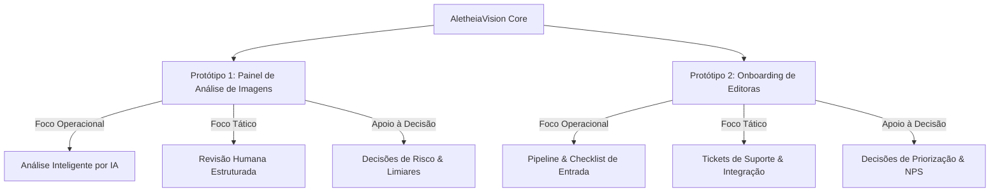

# 🔬 AletheiaVision Core — Plataforma de Integridade Científica

> **Entrega Integrada (A4)** — Protótipos 1 e 2 desenvolvidos para a disciplina de **Sistemas de Informação Gerenciais (SIG)** do curso de Sistemas de Informação.

---

## 📋 Sobre o Projeto

A **AletheiaVision IA** é uma startup de tecnologia focada na garantia da integridade de publicações científicas. A plataforma **AletheiaVision Core** unifica dois fluxos cruciais da operação em um único ecossistema web moderno e responsivo:



### 1. 🔍 Protótipo 1: Painel de Análise de Imagens Científicas
O núcleo principal da proposta de valor da startup. Representa a tela de processamento científico onde artigos biomédicos submetidos são avaliados contra fraudes visuais (duplicações, manipulação de pixels, montagens de experimentos).
* **Processo:** Recebimento de submissões ➔ Análise automática da IA com geração de score de similaridade ➔ Exibição de Heatmap (Mapa de Calor) ➔ Revisão e parecer técnico do Analista Humano.

### 2. 🤝 Protótipo 2: Módulo de Onboarding de Editoras
O módulo de apoio gerencial indispensável para a viabilidade do negócio. Ele gerencia o ciclo de vida inicial das editoras científicas clientes desde o fechamento do contrato até a entrada em produção.
* **Processo:** Cadastro de editoras ➔ Acompanhamento do funil de onboarding (Pipeline) ➔ Checklist de etapas técnicas/treinamento ➔ Integrações de APIs de submissão (OJS, ScholarOne) ➔ Monitoramento de satisfação inicial (NPS) e tickets de suporte.

---

## 🛠️ Stack Tecnológica

A plataforma foi implementada utilizando padrões de desenvolvimento frontend modernos e de alta performance:

*   **[React 19](https://react.dev/)** — SPA de alta performance, reativa e componentizada.
*   **[Vite](https://vite.dev/)** — Bundler extremamente ágil e ambiente de HMR em tempo real.
*   **[Tailwind CSS (v4)](https://tailwindcss.com/)** — Estilização moderna e responsiva utilizando tokens CSS nativos.
*   **[Lucide React](https://lucide.dev/)** — Ícones vetoriais modernos e adaptados à identidade visual tecnológica.

---

## ✨ Recursos de Cada Módulo

### 🔍 Protótipo 1: Painel de Análise de Imagens
* **Filtros Avançados:** Filtre as submissões científicas por Período, Editora, Área (Oncologia, Genética, Microbiologia), Risco (Baixo, Médio, Alto) e Status.
* **Painel de KPIs da Operação:**
  * *Artigos analisados:* 412 (Volume mensal).
  * *Imagens processadas:* 1.856 (Carga técnica).
  * *Precisão da IA:* 91,3% (Qualidade de detecção).
  * *Falsos positivos:* 7,8% (Ajustes de limiar).
  * *Tempo médio por artigo:* 3min42s.
  * *Casos pendentes:* 61 (Priorização de gargalos).
* **Tabela de Submissões Dinâmica:** Listagem de artigos contendo ID, Título, Editora, Área, Status da revisão e Score de Risco gerado pela IA.
* **Seção de Detalhes & Heatmap:**
  * Visualização lado a lado da **Imagem Original** da microscopia/eletroforese e do **Mapa de Calor** simulado destacando os pontos de suspeita de fraude identificados pela rede neural.
  * Informações técnicas: ID, Tipo de imagem, Score de similaridade global (Exemplo: 0.87) e Data de submissão.
* **Formulário de Parecer Humano:** Campo para decisão do analista (Confirmar suspeita, Descartar suspeita, Solicitar nova análise) com área para justificativas textuais técnicas e definição de prioridades (Baixa, Média, Alta, Crítica).

### 🤝 Protótipo 2: Onboarding de Editoras
* **Aviso de Contexto Gerencial:** Alerta explicativo reforçando o papel do módulo como braço operacional-administrativo de suporte à entrada de clientes.
* **Painel de KPIs de Adoção:**
  * *Editoras em implantação:* 8.
  * *Tempo médio de onboarding:* 6 dias.
  * *Taxa de conversão:* 42%.
  * *Tickets abertos:* 17.
  * *NPS médio:* 74.
  * *Integrações concluídas:* 5.
* **Pipeline Visual Interativo (Kanban):** Exibe graficamente o volume de clientes em cada uma das 8 fases do funil (`Lead recebido ➔ Demo realizada ➔ Proposta enviada ➔ Contrato assinado ➔ Integração API ➔ Treinamento ➔ 30 dias de uso ➔ Cliente ativo`).
* **Checklist Técnico e Comercial:** Lista de tarefas da implantação (Formulário, Demo, Contrato, Integração API, Treinamento, Primeiro artigo analisado, NPS de 30 dias).
* **Central de Suporte (Tickets):** Gestão rápida de tickets técnicos focados nas integrações de APIs das editoras, exibindo descrição do problema, prioridade, status e respostas enviadas.
* **Formulário de Ação Gerencial:** Permite ao gestor modificar o status da implantação, delegar responsáveis (Anthony, Luan, Isaque, Gabriel), prescrever próximas ações e anexar notas internas de acompanhamento.

---

## 📊 Apoio à Decisão Gerencial (SIG)

O principal objetivo acadêmico deste ecossistema é ilustrar como a informação estruturada apoia os diferentes níveis hierárquicos na tomada de decisões em um negócio de base tecnológica:

| Nível Hierárquico | Decisões Apoiadas (Módulo 1 - Análise de Imagem) | Decisões Apoiadas (Módulo 2 - Onboarding) |
| :--- | :--- | :--- |
| **Operacional** | * Quais imagens de altíssimo risco devem ser priorizadas imediatamente na fila do analista humano. | * Quais tarefas pontuais do checklist de implantação técnica ainda estão pendentes para liberar a editora. |
| **Tático** | * Ajuste fino do limiar (threshold) de risco da IA para balancear a taxa de falsos positivos e a sobrecarga humana. | * Alocação de responsáveis técnicos baseando-se no volume de artigos e prioridade crítica do cliente. |
| **Estratégico** | * Avaliação da maturidade técnica do motor de IA para embasar a expansão comercial em novos mercados científicos. | * Identificação dos perfis de editoras com menor tempo de onboarding e maior satisfação (NPS) para focar novos canais de vendas. |

---

## 📂 Estrutura do Código

A aplicação possui uma arquitetura altamente modular e limpa:

```text
AletheiaVision/
├── public/                 # Assets públicos globais
├── src/
│   ├── assets/             # Logos e mídias estáticas
│   ├── components/         # Pasta de componentes organizados por domínio
│   │   ├── client/         # Dashboard e Chamados na perspectiva do Cliente
│   │   │   ├── ClientDashboard.jsx
│   │   │   └── MyTickets.jsx
│   │   ├── onboarding/     # Componentes específicos do Módulo de Onboarding
│   │   │   ├── EditorOnboardingDetails.jsx
│   │   │   ├── EditorsTable.jsx
│   │   │   ├── OnboardingDecisions.jsx
│   │   │   ├── OnboardingFilters.jsx
│   │   │   ├── OnboardingKPIs.jsx
│   │   │   └── Pipeline.jsx
│   │   ├── DecisionsGrid.jsx     # Decisões do Módulo 1
│   │   ├── Filters.jsx           # Filtros do Módulo 1
│   │   ├── Header.jsx            # Barra superior (SaaS Header)
│   │   ├── KPIs.jsx              # Indicadores do Módulo 1
│   │   ├── ReviewForm.jsx        # Formulário do analista (Módulo 1)
│   │   ├── Sidebar.jsx           # Barra lateral (Orquestrador de Visões)
│   │   ├── SubmissionDetails.jsx # Detalhes/Heatmap (Módulo 1)
│   │   ├── SubmissionsTable.jsx   # Tabela de artigos (Módulo 1)
│   │   ├── TicketsManager.jsx    # Portal de Tickets do Staff
│   │   └── Toast.jsx             # Feedback visual flutuante
│   ├── App.jsx             # Componente central (Orquestrador de Estados e Rotas)
│   ├── App.css             # Regras customizadas de CSS
│   ├── index.css           # Arquivo do Tailwind CSS v4 & Design System
│   └── main.jsx            # Ponto de inicialização do React
├── eslint.config.js        # Configurações do Linter
├── package.json            # Scripts de build, dev e dependências NPM
└── vite.config.js          # Configurações do Vite
```

---

## 🚀 Como Executar o Projeto

1.  **Clone o Repositório e Navegue até o diretório:**
    ```bash
    cd AletheiaVision
    ```

2.  **Instale as dependências com o NPM:**
    ```bash
    npm install
    ```

3.  **Inicie a aplicação em ambiente local:**
    ```bash
    npm run dev
    ```

4.  **Visualize a plataforma:**
    Acesse a URL padrão disponibilizada pelo Vite, tipicamente `http://localhost:5173`.

---

## 👥 Equipe de Projeto (Sistemas de Informação)

*   **Anthony Quaresma** — Gestão do Projeto & Direção Comercial
*   **Luan Assis** — Arquitetura de Software & Desenvolvimento Técnico
*   **Isaque Severino** — Desenvolvimento Técnico & Infraestrutura de Dados
*   **Gabriel Rodrigues** — Desenvolvimento Técnico & Suporte de Negócios
